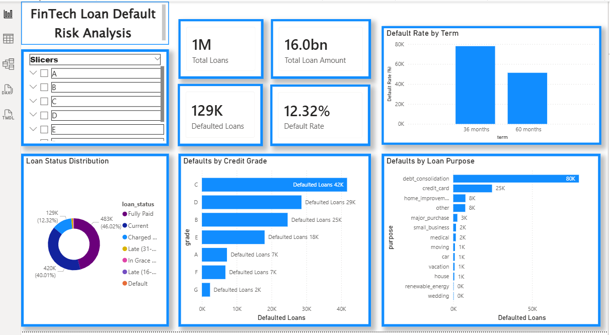

# 📊 FinTech Loan Default Risk Analysis (SQL)

## 📌 Project Overview
This project analyzes **real-world FinTech loan data** to identify **loan default risk patterns** using SQL.  
The goal is to understand how borrower characteristics such as **credit grade, income level, and loan purpose** impact loan defaults.

The analysis is performed entirely using **SQL** on a dataset containing **over 1 million loan records**, simulating real-world credit risk analysis used by banks and FinTech companies.

## 📊 Power BI Dashboard Preview

---

## 🎯 Objectives
- Analyze historical loan data to identify default trends  
- Define and calculate key default risk metrics  
- Segment default risk by credit grade, income group, and loan purpose  
- Generate insights useful for lending and risk assessment decisions  

---

## 🗂 Dataset
- **Source:** Lending Club Loan Dataset (Kaggle)
- **Records:** ~1,048,575 loans
- **Type:** Real-world peer-to-peer lending data

### Key Columns Used
- `id` – Loan identifier  
- `loan_amnt` – Loan amount  
- `term` – Loan tenure (36/60 months)  
- `int_rate` – Interest rate  
- `grade` – Credit grade (A–G)  
- `annual_inc` – Annual income  
- `loan_status` – Current status of the loan  
- `purpose` – Reason for taking the loan  
- `addr_state` – Borrower state  

---

## 🧠 Business Logic: Default Definition
For this analysis, a loan is classified as **defaulted** if its `loan_status` is:

- `Charged Off`
- `Default`
- `Late (31–120 days)`

This definition aligns with common **credit risk assessment practices**.

---

## 📐 Key Metrics Calculated
- Total number of loans  
- Number of defaulted loans  
- Overall default rate (%)  
- Default distribution by:
  - Credit grade  
  - Loan purpose  
  - Income group  

---

## 🧪 SQL Analysis Performed
The project uses **core SQL concepts**, including:
- `SELECT`, `WHERE`, `GROUP BY`, `ORDER BY`
- `CASE` statements for conditional logic
- Aggregate functions (`COUNT`, `SUM`)
- Handling large-scale datasets efficiently

All queries are written with **business clarity and readability** in mind.

---

## 📈 Key Insights
- Loan default risk increases significantly as credit grade moves from **A to G**
- **Debt consolidation** loans contribute the highest share of defaults
- Lower income segments show higher concentration of defaulted loans
- Credit grade is the strongest predictor of loan default among analyzed factors

---

## 📁 Project Structure
fintech-loan-default-sql/
│
├── data/
│ └── (dataset not uploaded due to size)
│
├── sql/
│ └── loan_default_analysis.sql
│
├── insights/
│ └── key_findings.md
│
└── README.md
## 🛠 Tools & Technologies
- **MySQL** – Data storage and querying  
- **SQL** – Data analysis and aggregation  
- **Excel** – Initial data inspection and cleaning  

---

## 🚀 How This Project Adds Value
This project demonstrates:
- Ability to work with **large, real-world datasets**
- Strong understanding of **business-driven SQL analysis**
- Practical exposure to **FinTech and credit risk analytics**
- End-to-end ownership: data ingestion → analysis → insights

---

## 📌 Future Enhancements
- Implement predictive modeling techniques such as Logistic Regression or Random Forest to forecast the probability of loan default.
- Enhance the dashboard with advanced analytics features like dynamic filters, drill-down capabilities, and key performance indicators (KPIs) for better decision-making.
- Optimize database performance by applying indexing and query optimization techniques to handle large-scale financial datasets efficiently.
- Incorporate time-series analysis to monitor default trends over months or years and identify seasonal risk patterns.

---

## 👤 Author
**Jishnu Pramod**  
Aspiring Data Analyst | SQL | Power BI | Python
